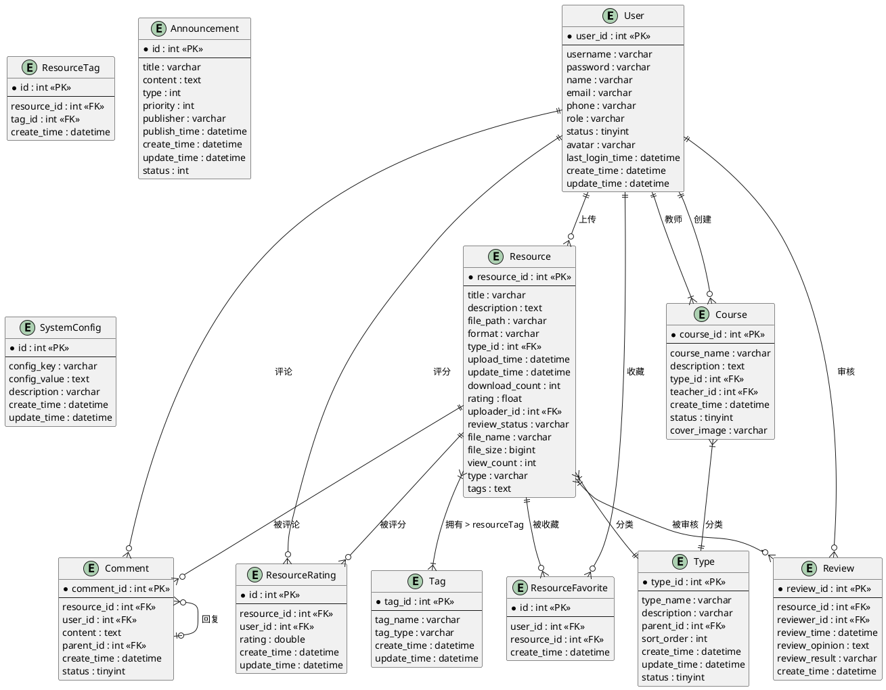
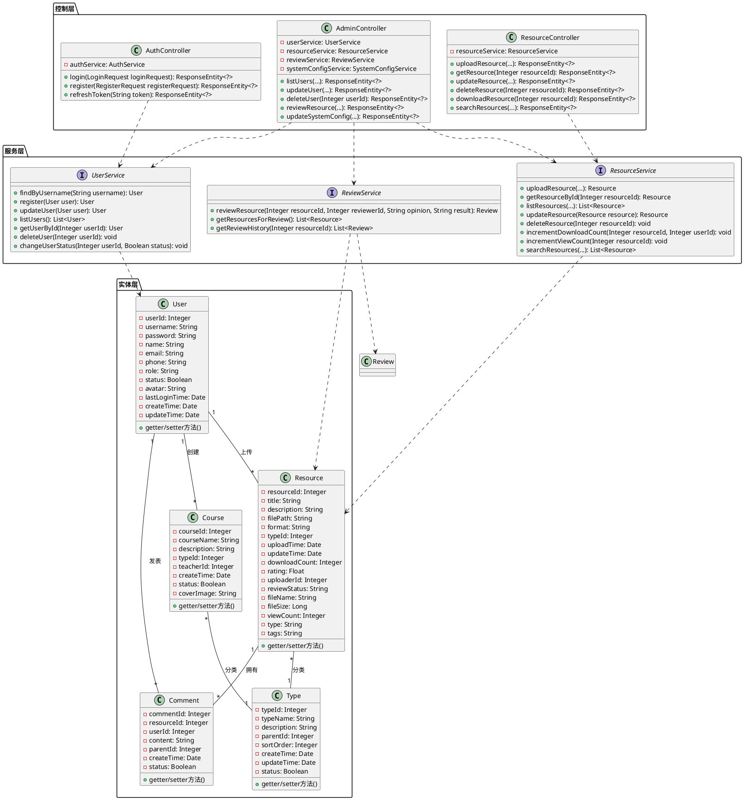
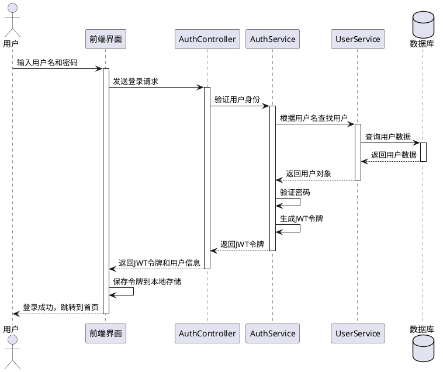
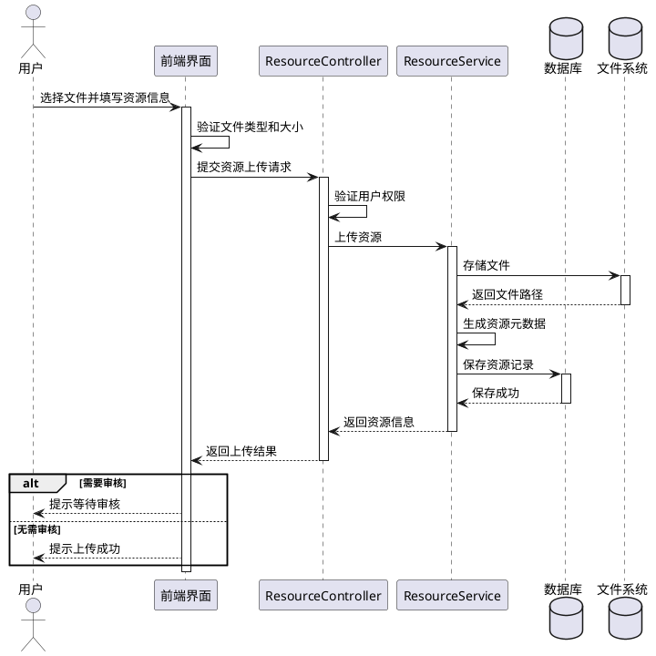
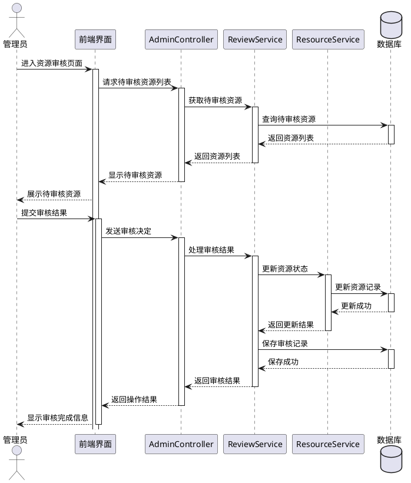

# 数字化教学资源共享平台系统图表

## 1. ER 图（实体关系图）

## 2. 类图

## 3. 用户登录时序图

## 4. 资源上传时序图

## 5. 资源审核时序图

## 使用说明

1. 复制以上代码到 PlantUML 在线编辑器（如 http://www.plantuml.com/plantuml/uml/）
2. 生成图片后下载保存
3. 在论文中插入这些图片并添加相应说明
